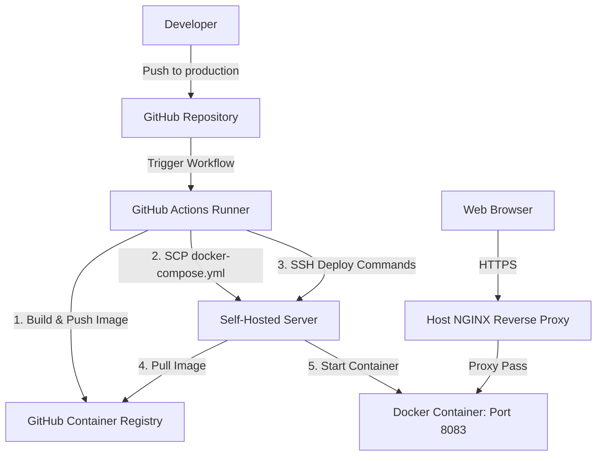

# Deployment Guide: Self-Hosted Docker Server

This guide provides step-by-step instructions to set up the CI/CD pipeline, prepare your host server, configure the NGINX reverse proxy, and deploy the application.

---

## Architecture Overview



---

## Step 1: Configure GitHub Secrets

For GitHub Actions to deploy to your server, you must add SSH credentials to your repository secrets.

1. Go to your GitHub repository: `https://github.com/gspavan07/ofzen-web`
2. Navigate to **Settings** > **Secrets and variables** > **Actions**.
3. Click **New repository secret** for each of the following:

| Secret Name | Description | Example / Instructions |
| :--- | :--- | :--- |
| `SSH_HOST` | The IP address or domain name of your server. | `192.168.1.50` or `your-server.com` |
| `SSH_USER` | The user name to access the server. | `root` or `ubuntu` |
| `SSH_PRIVATE_KEY` | The SSH private key to log into the server. | Paste the entire content of your private key file (e.g. `~/.ssh/id_rsa`). |

> [!IMPORTANT]
> Make sure the corresponding public key (e.g., `id_rsa.pub`) is added to the `~/.ssh/authorized_keys` file of the user on your host server.

---

## Step 2: Prepare Your Server

Log into your server via SSH and verify that the required dependencies are installed:

### 1. Check Docker & Compose
Ensure Docker is installed and running:
```bash
docker --version
docker compose version
```

### 2. Check Host NGINX
Verify NGINX is installed on your host server:
```bash
nginx -v
```
*(If NGINX is not installed, install it via `sudo apt update && sudo apt install nginx -y` on Ubuntu/Debian).*

---

## Step 3: Configure Host NGINX Reverse Proxy

To route incoming traffic from your custom domain to your Docker container (running internally on localhost port `8083`), you need to create a server block in your host's NGINX configuration.

### 1. Create the Site Configuration
Create a new configuration file on your server (replace `your-domain.com` with your actual domain):
```bash
sudo nano /etc/nginx/sites-available/ofzen-web
```

### 2. Paste the Server Block
Add the following configuration (make sure to replace `your-domain.com` with your domain):
```nginx
server {
    listen 80;
    server_name your-domain.com; # Change to your domain

    # Increase client body size if uploads are needed
    client_max_body_size 20M;

    location / {
        proxy_pass http://127.0.0.1:8083;
        proxy_set_header Host $host;
        proxy_set_header X-Real-IP $remote_addr;
        proxy_set_header X-Forwarded-For $proxy_add_x_forwarded_for;
        proxy_set_header X-Forwarded-Proto $scheme;
        
        # Enable WebSockets support (needed for hot-reloads/previews if applicable)
        proxy_http_version 1.1;
        proxy_set_header Upgrade $http_upgrade;
        proxy_set_header Connection "upgrade";
    }
}
```

### 3. Enable the Configuration
Enable the site by symlinking it to the `sites-enabled` directory:
```bash
sudo ln -s /etc/nginx/sites-available/ofzen-web /etc/nginx/sites-enabled/
```

### 4. Test and Reload NGINX
Test the configuration file for syntax errors:
```bash
sudo nginx -t
```
If the test is successful, reload NGINX to apply changes:
```bash
sudo systemctl reload nginx
```

---

## Step 4: Secure with SSL (HTTPS)

It is highly recommended to secure your domain with HTTPS. You can easily get a free SSL certificate from Let's Encrypt using Certbot.

1. Install Certbot and the NGINX plugin:
   ```bash
   sudo apt install certbot python3-certbot-nginx -y
   ```
2. Obtain and install the SSL certificate:
   ```bash
   sudo certbot --nginx -d your-domain.com
   ```
3. Follow the interactive prompts. Certbot will automatically rewrite your NGINX configuration to support HTTPS on port 443 and redirect all HTTP traffic to HTTPS.

---

## Step 5: Run the First Deployment

Once server setup and GitHub Secrets are configured, you can trigger the CD pipeline:

1. **Commit and Push to GitHub**:
   Push your changes to the `production` branch:
   ```bash
   git add .
   git commit -m "Configure self-hosted deployment"
   git push origin production
   ```
2. **Watch the Workflow**:
   - Go to your repository on GitHub.
   - Click the **Actions** tab.
   - You will see the **CI/CD to Self-Hosted Server** workflow running.
   - Once it completes, the workflow will have built your container, pushed it to GHCR, transferred `docker-compose.yml` to your server under `~/deployments/ofzen-web/`, and restarted the service.

---

## Step 6: Server Management & Monitoring

Here are useful commands to manage and monitor your application directly on your server:

### 1. View Running Containers
Verify that the `ofzen-web-container` is running:
```bash
docker ps
```

### 2. View Application Logs
Check runtime logs for containerized NGINX (routing/requests):
```bash
cd ~/deployments/ofzen-web
docker compose logs -f
```

### 3. Restart the Container Manually
If you need to manually restart the container:
```bash
cd ~/deployments/ofzen-web
docker compose restart
```

### 4. Rebuild/Pull Manually on the Server
If you ever want to bypass GitHub Actions and pull the latest image directly:
```bash
cd ~/deployments/ofzen-web
# (Optional) docker login ghcr.io
docker compose pull
docker compose up -d
```
